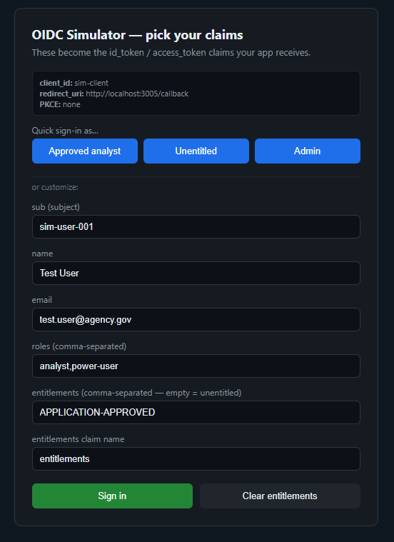

# OIDC / Okta Simulator (local testing)

A tiny fake identity provider that speaks enough **OpenID Connect (Authorization
Code + PKCE)** to test a real client app's login flow locally — **without** a real
Okta tenant. You control the claims (`sub`, `email`, `roles`, `entitlements`, …) from
a small login page, so you can test entitled vs. unentitled users, different roles, etc.

<p align="center">
  
</p>

<p align="center"><em>This page replaces Okta's PIV/certificate prompt — you type the claims your app will receive.</em></p>

> ⚠️ **Test double — localhost/dev only.** It trusts any `client_id`/`redirect_uri`
> and mints tokens with whatever claims you type. Never expose it publicly.

---

## Run

```bash
pip install -r requirements.txt
python app.py
```

Listens on **http://localhost:9000**. Sanity check:
- Discovery: http://localhost:9000/.well-known/openid-configuration
- JWKS:      http://localhost:9000/.well-known/jwks.json

Change host/port/issuer with env vars: `SIM_ISSUER`, `SIM_PORT`.

---

## Point your app at it

The issuer is **`http://localhost:9000`**. The client_id can be anything (the sim
accepts all). Your app's redirect_uri must be whatever it already uses.

### Frontend (react-oidc-context / oidc-client-ts)
```
OIDC_ISSUER    = http://localhost:9000
OIDC_CLIENT_ID = sim-client            # any value
# redirect_uri = http://localhost:3005/...  (whatever your app uses)
# scope        = openid profile email
```
The client auto-discovers `/authorize`, `/token`, `/jwks` from the issuer.

### Backend (Flask auth.py)
```
OIDC_ENABLED              = true
OIDC_ISSUER               = http://localhost:9000
OIDC_JWKS_URI             = http://localhost:9000/.well-known/jwks.json
OIDC_ENTITLEMENTS_CLAIM   = entitlements          # match the login page field
OIDC_REQUIRED_ENTITLEMENT = APPLICATION-APPROVED
# OIDC_AUDIENCE (if you enforce aud) = sim-client  (must equal client_id)
```

The tokens it mints are **RS256-signed** with a `kid` that matches the JWKS, so your
backend's normal `kid` → JWKS → verify path works unchanged.

---

## The login flow

1. Your app redirects the browser to `/authorize` (with PKCE).
2. The simulator shows a **login page** pre-filled with claims.
3. Edit the claims, click **Sign in** → it redirects back to your app with a code.
4. Your app exchanges the code at `/token` (PKCE verified) → gets `id_token` +
   `access_token` containing those claims.

Step 2 is the whole point — it's where a real Okta would do PIV/certificate auth, and
instead you just type the claims ([screenshot above](#oidc--okta-simulator-local-testing)).
The grey box at the top of that page echoes back the `client_id`, `redirect_uri` and PKCE
method your app actually sent, which is the fastest way to confirm the client is
configured the way you think it is.

### One-click preset users
The login page has quick-login buttons that fill the claims and sign in immediately:
- **Approved analyst** — `roles: analyst,power-user`, `entitlements: APPLICATION-APPROVED`
- **Unentitled** — `roles: analyst`, `entitlements:` *(empty)* → exercises the 403 gate
- **Admin** — `roles: admin,analyst,power-user`, `entitlements: APPLICATION-APPROVED`

Edit the `PRESETS` list near the bottom of `app.py` to change them.

### Or test manually
- **Entitled (happy path):** leave `entitlements = APPLICATION-APPROVED` → your app grants access.
- **Unentitled (403 path):** click **"Clear entitlements"** (or empty the field) → your
  app's entitlement gate should block the data.
- **Roles / other claims:** edit `roles` or any field to exercise role checks.
- **Namespaced entitlements claim:** set the *entitlements claim name* to e.g.
  `https://agency/entitlements` and match `OIDC_ENTITLEMENTS_CLAIM` on the backend.

---

## Docker

### Standalone
```bash
docker compose up --build      # → http://localhost:9000
```

### Alongside your app's stack
Copy the `oidc-sim` service from `docker-compose.yml` into your app's
`docker-compose.dev.yml`, on the same network. **One gotcha:** the browser and the
backend reach the simulator by **different hostnames**, so the issuer and the JWKS URL
are set differently (this is exactly why `OIDC_ISSUER` and `OIDC_JWKS_URI` are separate).

```yaml
  oidc-sim:
    build: ../f_okta_oidc_simulation      # path to this folder
    container_name: oidc_sim
    ports:
      - "9000:9000"
    environment:
      - SIM_ISSUER=http://localhost:9000  # the BROWSER-facing URL → goes in the token `iss`
    networks:
      - app-net
```

Then your **backend** service env:
```
OIDC_ISSUER   = http://localhost:9000                              # match token `iss` (browser URL)
OIDC_JWKS_URI = http://oidc-sim:9000/.well-known/jwks.json         # container-to-container URL
```
- Frontend validates `iss` against the discovery doc it fetched from `http://localhost:9000` → so `SIM_ISSUER` (and the token's `iss`) must be `http://localhost:9000`.
- Backend **can't** reach `http://localhost:9000` from inside its own container, so it fetches JWKS via the service name `http://oidc-sim:9000/...` — but still validates `iss` as `http://localhost:9000`. The two URLs are intentionally different.

---

## Endpoints

| Method | Path                                   | Purpose                          |
|--------|----------------------------------------|----------------------------------|
| GET    | `/.well-known/openid-configuration`    | discovery document               |
| GET    | `/.well-known/jwks.json`               | public signing keys (JWKS)       |
| GET    | `/authorize`                           | login page; you pick the claims  |
| POST   | `/login`                               | issues auth code, redirects back |
| POST   | `/token`                               | code (+PKCE) → tokens            |
| GET    | `/userinfo`                            | claims for a bearer access token |
| GET    | `/logout`                              | end-session (redirect back)      |

---

## Notes / limits (kept intentionally simple)

- Signing keys are regenerated **each time you start** the process. If your app
  cached the old JWKS, restart it too (or it'll fail `kid` lookup).
- Auth codes are stored **in memory** and expire after 5 minutes.
- Custom claims (`roles`, `entitlements`) are placed in **both** the id_token and the
  access_token, so it works whichever one your app validates.
- No client registration, no refresh tokens, no consent screen — by design.
